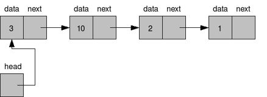
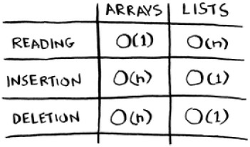

# Day 3: Data Structure in Rust - Linked List - 25-02-2024

## Introduction
### The 'Why' Behind Data Structures

**Structs and enums are amazing! But there are limitations to what they can easily model:**
- Fixed Size: A struct with 3 fields always takes up the same amount of memory, regardless of how much data you actually need to store.
- Relationships: How do you elegantly represent hierarchies or connections where the number of elements can grow or shrink? It gets clunky with just structs within structs.

**Enter Linked Lists**
- A Chain of Boxes: A linked list can be thought of as individual boxes (nodes) where:
    - Each box holds your data.
    - Each box has a pointer (like a reference!) to the next box in the chain.
- Benefits:
    -Dynamic Size: Add or remove items by just changing the pointers between boxes. No need to know how many items you'll have in advance.
    -Insertion/Removal: Can insert in the middle of a list just by adjusting pointers, unlike an array where you'd shift elements.

**Rust Twist: Ownership in Linked Lists**
1. Who Owns What: Each node in the list "owns" its data and the pointer to the next node.
2. Lifetime Matters: When a node is removed, the linked list is responsible for ensuring there are no dangling pointers, just like Rust prevents dangling references in regular code.

### Day 3: Approach
- Visualization: We'll use drawings and diagrams to solidify how linked lists work before a single line of code.
- Simple 'Node' Struct: You'll define a struct representing a single node in a list. This will involve:
    - A field for data (let's keep it generic - you can use T to represent any kind of data)
    - A field to potentially hold a reference to the next node. This is where it gets interesting! We'll likely use Rust's Box<T> type.
- List Representation (Maybe): If we have time, we'll start thinking about a struct to represent the whole list itself.

Prepare Your Mental Canvas

Here are some resources for reference (no need to stress about understanding all the code in them right now):

1. Visualizing Linked List: https://visualgo.net/en/list Play around with this!
2. Simple Rust Example: (Focus on the Node struct definition) https://rust-unofficial.github.io/too-many-lists/first-layout.html


## What is it?
[Linked List](https://pt.wikipedia.org/wiki/Lista_ligada) is a linear data structure that allows the data dynamically grow or shrink.
This capability to change its size is important and implemented in different use cases. For example:
- A [queue](https://en.wikipedia.org/wiki/Queue_(abstract_data_type)) is an implementation of a Linked List with FIFO (First-in-First-out). The main logic is the first to get in the queue is the first to get out. This structure is very useful when you need to perform a task whenever one arrives like Message System and Order System.
- The Rust [Smart Pointers](https://doc.rust-lang.org/book/ch15-00-smart-pointers.html) use it to avoid cloning complex structures by saving its contents in heap memory and assigning the structure a pointer for its contents.

### Concepts
It's a linear structure, so the visual concept is like a rope with knots, each one points to another. Like the rope, a Linked List has a **head** and **tail** to reference the first and the last node of the list. Those references are important to perform ***constant time***, **O(1)**, to **delete** and **insert** both front and back in the List. To read some content in the list, you have to interact from the first till your node in a list. For that reason, the Linked list has sequential access (**linear time**), for **reading O(n)**


*Visual illustration of an integer Linked Link. Each Node points to another Node. Observe the last Node points _to nothing _indicating_ the end_ of the List*.


### Space and Scalability Complexity (Big O Notation)
#### Space Complexity
This indicates the efficiency of memory usage for an algorithm or data structure. Linked List doesn't perform memory overhead because with value inserted in the List is just a pointer to its location. So the size of the List remains the same while it is growing or shrinking.

#### Scalability Complexity

*Table summarizing the Big O Notation for the Arrays and List*.

In most cases, the complexity is O(1) or O(n), but it depends on the situation and the action.

##### Read
###### Beginning
To read a value at the beginning is O(1) because the **head** attribute references the first value.
###### Middle
In the middle is O(n) because the program has to flip over the list until finds the value.
###### End
Like the beginning, to read a value at the end is O(1).

##### Insert
###### Beginning
To insert a value at the beginning is O(1), so only you have to do is update the **head** attribute to reference the newest value.
###### Middle
In the middle is O(n) because the program has to flip over the list until finds the value and updates the reference.
###### End
Like the beginning, to insert is O(1) because you only have to update the **tail** attribute with the newest value.

##### Deletion
Same the [Insert](#Insert) reasons.


### Linked List in Rust

Rust implements its own [Linked List](https://doc.rust-lang.org/std/collections/struct.LinkedList.html) for the language. This is a [Doubly Linked List](https://pt.wikipedia.org/wiki/Lista_duplamente_ligada), so each node has back and front references.

#### Basic usage

to initialize, use the ``new`` method

```rs
use std::collections::LinkedList

#[derive(Debug)]
struct Expense(f32);


let mut list = LinkedList::new();
```

The ``LinkedList`` struct implements the basic methods for a list like ``push_back`` and `push_front` for inserting value back and front, as well ``pop_front`` and ``pop_back`` for deletion and ``back`` and ``front`` to retrieve the **head** and **tail** of the list.

##### Inserting
Rust allows us to insert both front and back in the list in an O(1) constant time using the methods ``push_front`` and ``push_back``.

```rs
list.push_back(Expense(54.242));
list.push_back(Expense(32.242));
list.push_front(Expense(879.242));

println!("{:?}", list); // [Expense(1233.52), Expense(879.242), Expense(54.242), Expense(32.242)]
```

##### Deletion
Is like the inserting methods, using the ``pop_back`` and ``pop_front`` to remove values in the back and front with O(1) scalability.

```rs
list.pop_back();
list.pop_front();
println!("{:?}", list); // [Expense(879.242), Expense(54.242)]

```

To remove a value at a specific position, use the ``remove(idx)`` method. This method has O(n) performance and **panic** if there isn't any value in the position.

```rs
list.remove(1);
println!("{:?}", list); // [Expense(879.242)]
```

##### Reading
For reading you have to loop through the list until you find the value you're looking for. The Linked List, like other `collections` types, implements the ``Iterator`` trait, so you can use it to perform some basic functionalities. As you have to iterate over the list reading the content, this has O(n) performance.

```rs
impl Expense {
    fn print_total<T: Iterator<Item = Self>>(iter: T) {
        let sum = iter.fold(0f32, |sum, curr| sum + curr.0);

        println!("Total values: {}", sum);
    }
}


Expense::print_total(list.into_iter()); // Total values: 879.242
```


